# Web App Dev 2 - Assignment 1 - ReactJS app.

Name: [Emma Nolan]

## Overview.

### New Pages.
+ List of Upcoming movies.
+ List of Tv shows
+ List of Popular Actors
+ (Modified) Movie Details page - added chips for Recommended Movies which are each links to the movies named in the chip. and added two natigation icons for Similar Movies (A drawer opens when clicked which will show five movies that are similar to it) and Reviews 
+ List of Cast and Crew of a movie.
+ Actors details (Has links to send you to tv shows/movies that they are in)
+ Tv details 
+ Top Rated shows
+ (Modified) Site header - When clicked on the favourite button in header it will drop down a menu that list all the favourites (Tv Shows, Movies and Poeple
+ Favourite Actors 
+Favourite People (Actors/Crew)
+ (Modified) Discovered Movie Page - So that the movie card now has a Link to its cast and crew (credits)
+(Modified) UpComing + Discover Movies - So that the playlist icon only stays on the Upcoming movie page. (Should not appear in the Discover Movie)

### New Features.

+ Sort Credits (Cast + Crew ) list by deparments (e.g. Popular poeple and cast + crew page)
+ Create a a favourite for Tv show and Actors (Can remove them as well)
+ See cast + Crew of a Movie
+ See movie and Tv show a actor/crew feature in 
+ Sort Credits (Cast + Crew) List by their name 
+ Sort Tv show by Genre and Name

## Setup requirements.

[None that I am aware of]

## TMDB endpoints.
[ List the __additional__ TMDB endpoints used, giving the description and pathname for each one.] 

e.g.

+ /movies/{movie_id}/reviews - The user reviews or a movie.
+ /movie/{movie_id}/similar - A list of similar movies. 
+ /person/popular - A list of popular actors.
+/genre/movie/list? - List of Genres of a Movie
+/tv/${id} - get tv show based on a id 
+ movie/${id}? - get Movie based on a id
+/discover/tv? - get Tv shows 
+/discover/movie? - get Movies
+ configuration/jobs? - get Deparments in a Cast and Crew
+ movie/${id}/images? - get images belong to a movie
+tv/${id}/images? - get images belong to a Tv Show
+/person/${id}/images? - get images belonging to a Person
+person/${id}/movie_credits? - get movie that a person feature in 
+person/${id}/tv_credits? - get Tv shows that a person featured in 
+movie/${id}/recommendations? - get recoomendation based on a movie
+/person/${id}? - get the person that owns this id 
+movie/${id}/credits? - get cast and crew of this movie
+movie/upcoming? - get upcoming movies
+movie/top_rated? - get top rated movies
## App Design.

### Component catalogue.
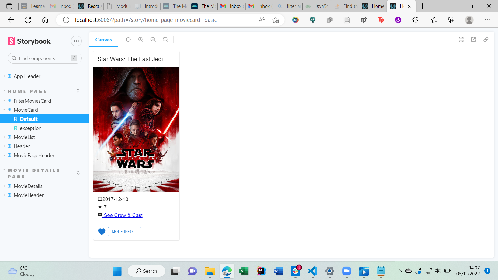 - Added link to cast and details
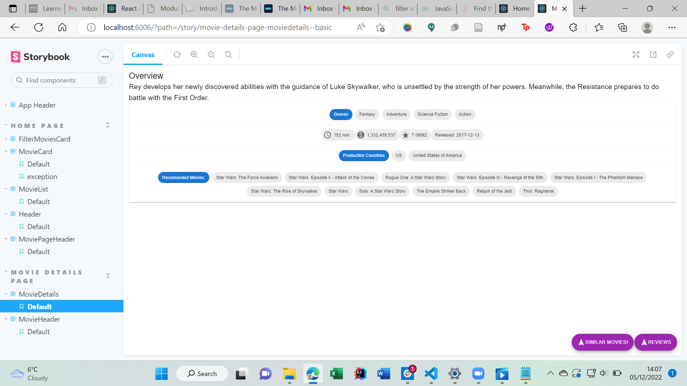 - Added links to recommended movies and similar movies
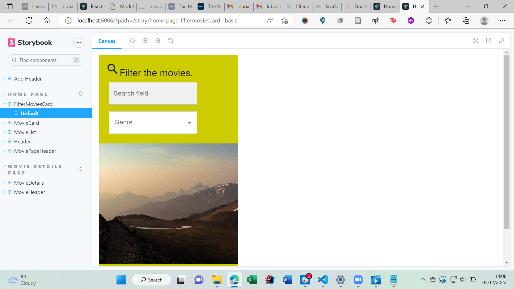 

### UI Design.

[ Insert screenshots of the __new app pages__ you developed (including modified existing pages), Have an appropriate caption for each one (see example below).

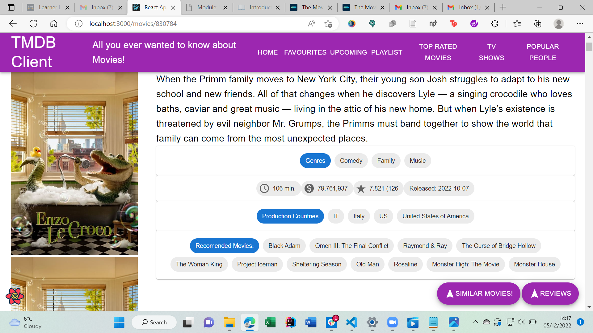

>Shows detailed information on a movie. Clicking the 'Reviews' floating action button will display extracts from critic reviews.Clicking the "Similar" floating action button will display extracts from the similar ovies api. Click on the chips showing recommend movies will bring to that specific movie info

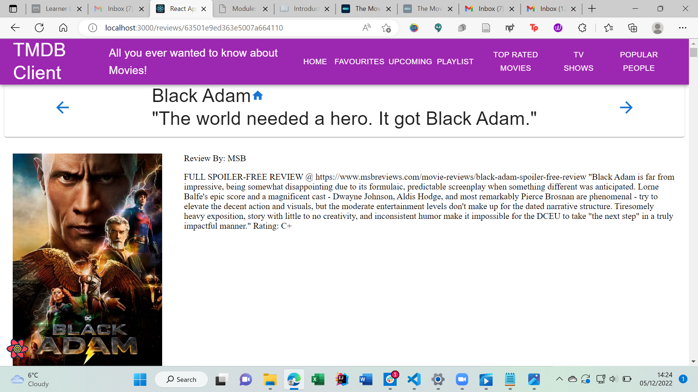

>Shows the full review for a movie.

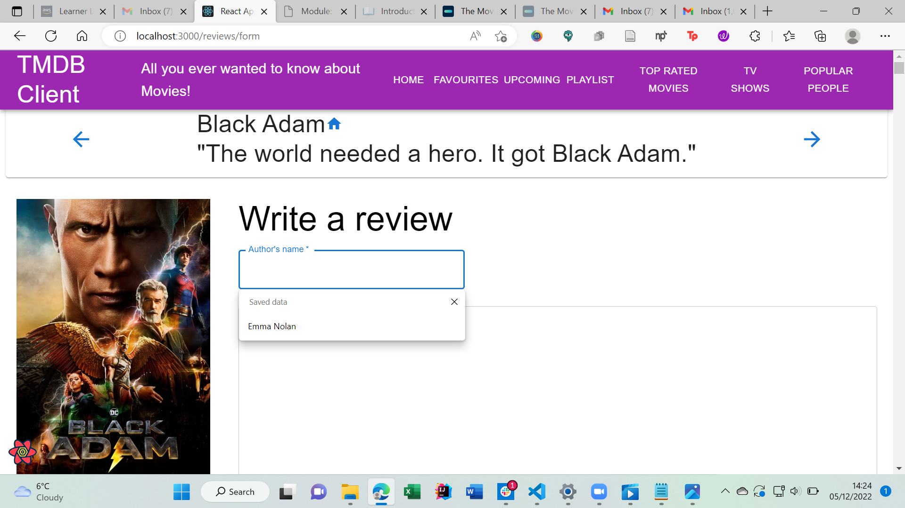

> Page to write a review 
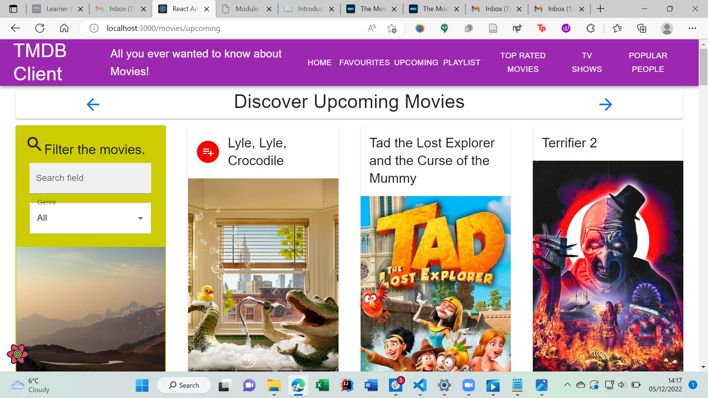
> Shows added icon to the movie card 
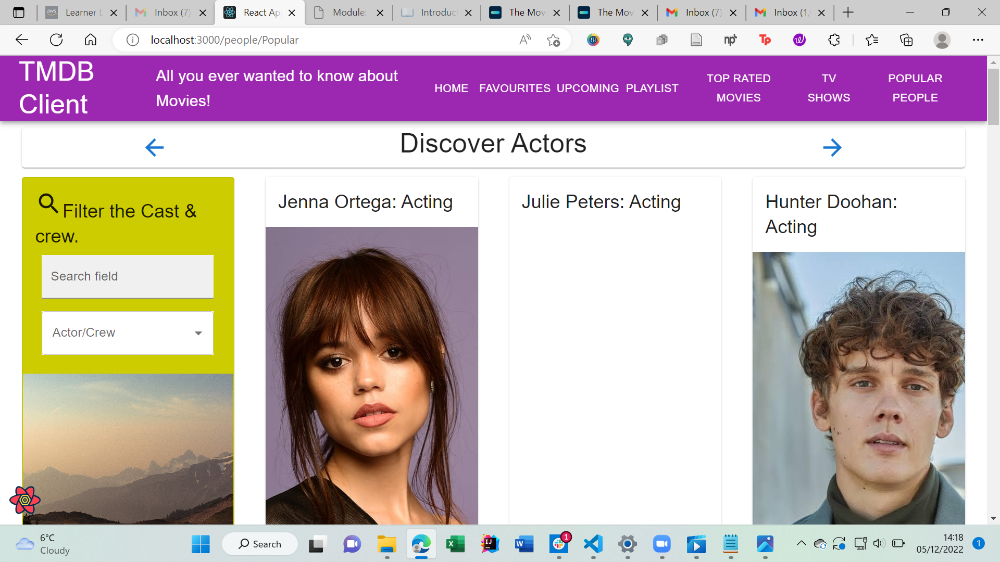
> Displays Actors (Popular )

> Shows cast and crew of a movie selected (Black Adam)
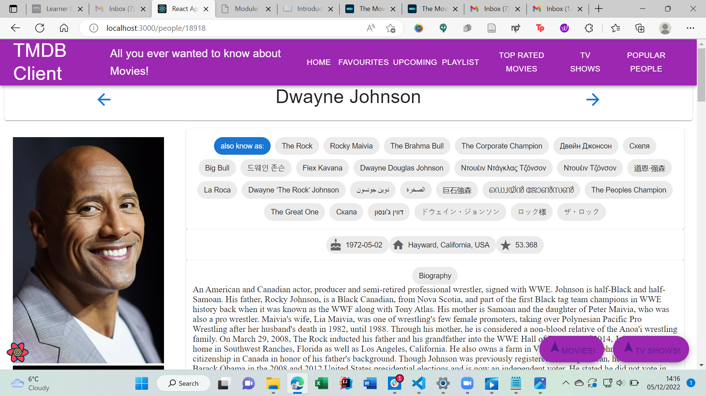
> Shows details of the person selected (Bio etc). Clicking the 'Movies' floating action button will display movies the person has featured in.Clicking the "Tv Show" floating action button will display Tv shows the actor features in.
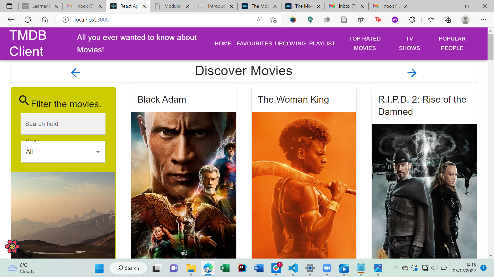
> Shows movies 
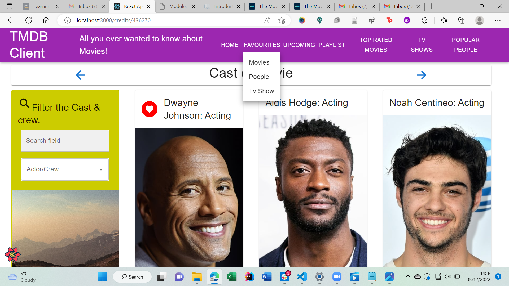
> shows drop down menu in action 
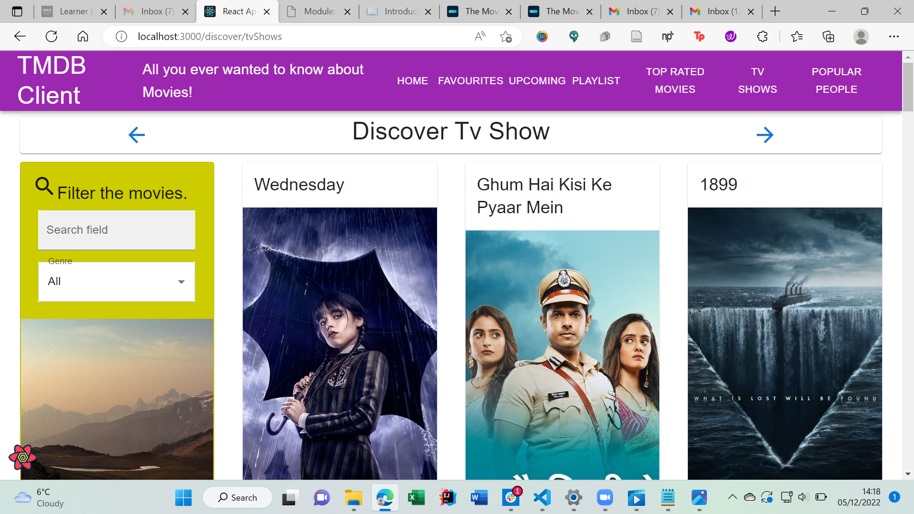
> shows Tv shows (Discover)
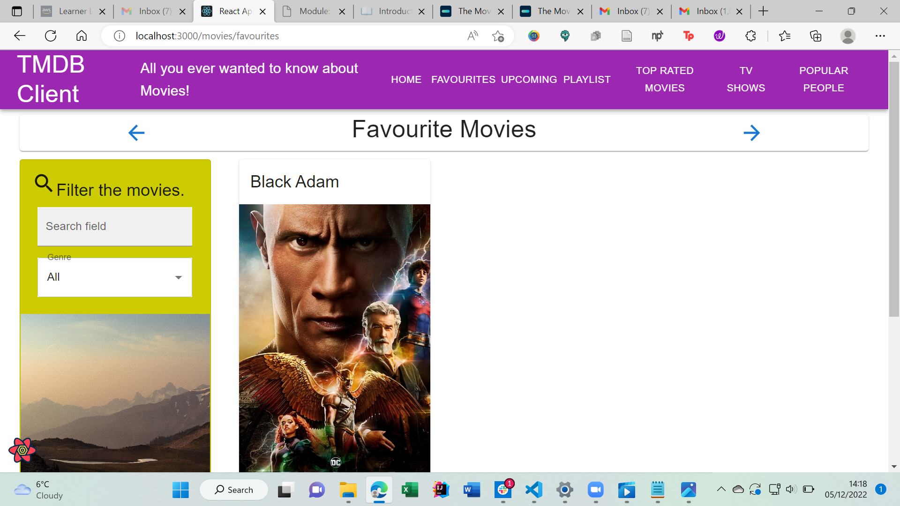
>Displays favourite Movies
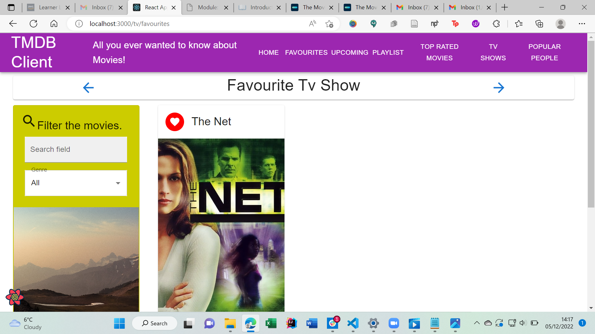
>Shows favourite tv show
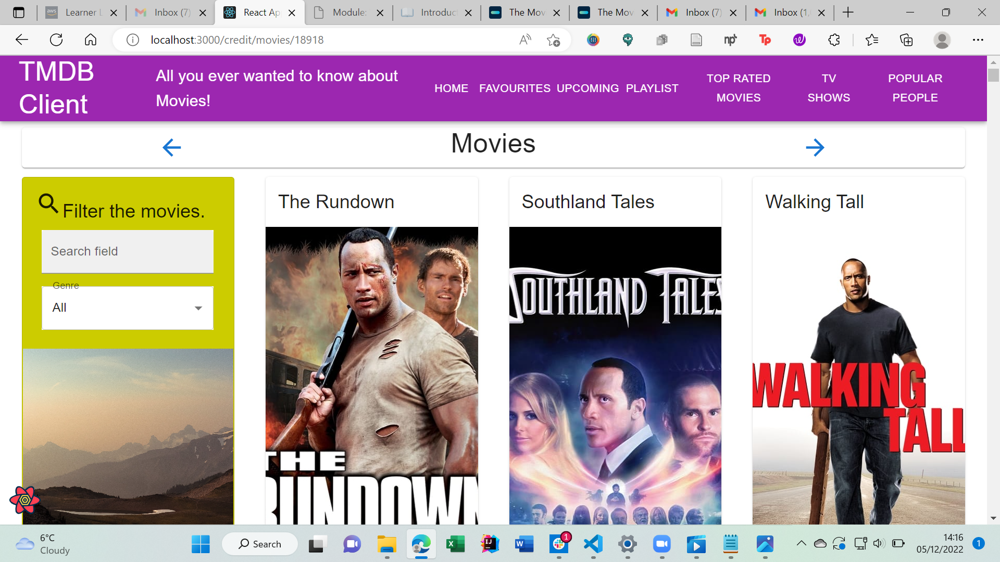
> Displays movies that a selected person features in 
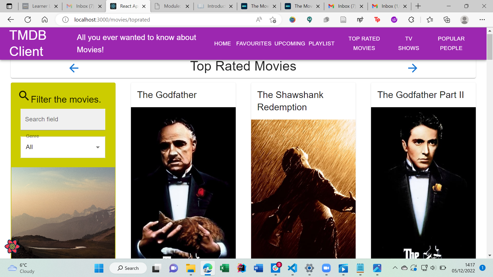
> Shows top rated movies
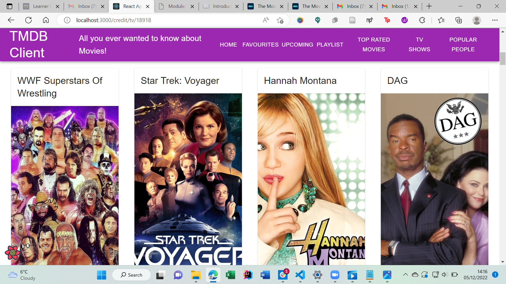
> Displays tv shows that feature a selected persob
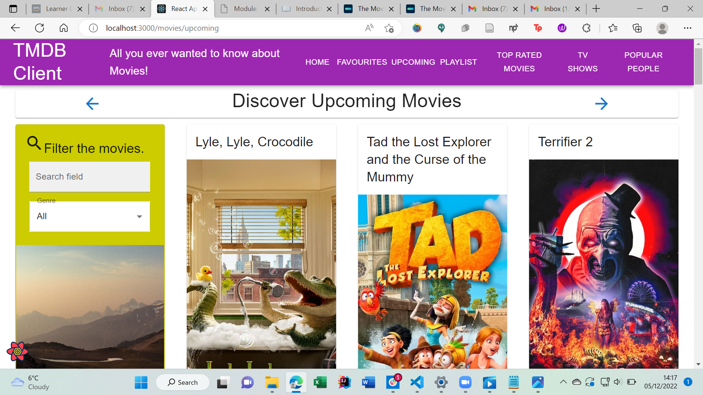
Displays up coming movies 

### Routing.

        +"/movies/favourites" - Favourite Movie
        +"/movies/playlist" - Playlist
        +"/movies/toprated" - Top Rated Movie Page
        +"/people/favourites" - Favourite Poeple page
        +"/credit/movies/:id" - Actor that feature in Movies
        +"/credit/tv/:id" - Actors that Feature in Tv Show
        +"/people/:id" - More details on a person (Actor/Crew)
        +"/tv/:id" - More info for the tv show
        +"/tv/favourites" - favourite tv show 
        +"/discover/tvShows" - Get tv shows (Tv Show Page)
        +"/people/Popular" - Get Popular Poeple Page (Cast & Crew)
        +/credits/:id - Get cast and crew based on a movie id 
        +"/movies/upcoming" - get upcoming movies 
        +/reviews/:id - get reviews on a movie

